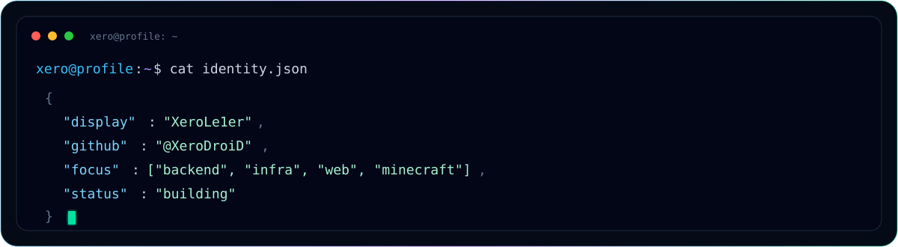
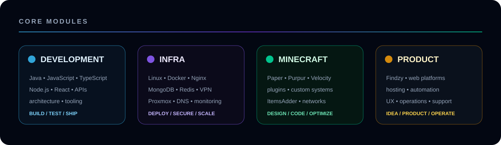

<!--
╔══════════════════════════════════════════════════════════════════════╗
║                     X E R O L E 1 E R                               ║
║              Developer • Infrastructure • Minecraft                 ║
╚══════════════════════════════════════════════════════════════════════╝
-->

<p align="center">
  
</p>

<p align="center">
  <a href="./README.md"></a>
  <a href="./README_EN.md"></a>
</p>

<p align="center">
  <a href="https://github.com/XeroDroiD"></a>
  <a href="https://findzy.fr"></a>
  
  
</p>

<p align="center">
  
</p>


## `01 // IDENTITY`

<p align="center">
  
</p>

I'm **XeroLe1er**, a developer focused on **backend**, **infrastructure**, **web** and **Minecraft ecosystems**.

What I enjoy most is not simply writing a class or building a polished interface. I like taking an idea and building **the whole system around it** — API, database, cache, networking, containers, deployment, security, monitoring and user experience.

> **My playground:** making code, services and infrastructure communicate cleanly.


## `02 // WHAT I BUILD`

<p align="center">
  
</p>

<table>
<tr>
<td width="50%" valign="top">

### `// SOFTWARE`
- Backends and APIs
- Internal tools and automation
- Web applications and interfaces
- Java plugins
- Service integrations
- Event/cache-oriented architecture

</td>
<td width="50%" valign="top">

### `// INFRASTRUCTURE`
- Linux / Debian
- Docker and isolated services
- Reverse proxy / Nginx
- MongoDB / Redis
- VPN and private networking
- Proxmox / virtualization
- DNS, DHCP and monitoring

</td>
</tr>
<tr>
<td width="50%" valign="top">

### `// MINECRAFT`
- Paper / Purpur
- Velocity
- Custom plugins and APIs
- Multi-server networks
- ItemsAdder / resource packs
- Advanced menus and interfaces
- Optimization and profiling

</td>
<td width="50%" valign="top">

### `// PRODUCT`
- Hosting and web services
- Operations automation
- User experience
- Administration tooling
- Deployment and maintenance
- Turning ideas into products

</td>
</tr>
</table>


## `03 // STACK`

### Languages & development

<p align="center">
  
</p>

### Data, infrastructure & tooling

<p align="center">
  
</p>

```text
BACKEND      Java • Node.js • APIs • event-driven systems
FRONTEND     JavaScript • TypeScript • React • HTML • CSS
DATA         MongoDB • Redis • MySQL
INFRA        Linux • Docker • Nginx • VPN • Proxmox
MINECRAFT    Paper • Purpur • Velocity • custom plugins
TOOLING      Git • GitHub Actions • Maven • Gradle
```


## `04 // CURRENT PROJECTS`

<table>
<tr>
<td width="50%" valign="top">

### 🌐 Findzy
**Web & hosting ecosystem**

A platform built around digital services, **Web/VPS hosting** and online tooling.

[](https://findzy.fr)

`web` `hosting` `VPS` `automation` `operations`

</td>
<td width="50%" valign="top">

### 🏝️ PlaneSky
**Custom SkyBlock — private project**

Minecraft ecosystem with custom interfaces, plugins, resource pack, synchronized menus and custom gameplay.

`Java` `Paper` `Velocity` `ItemsAdder` `MiniMessage`

</td>
</tr>
<tr>
<td width="50%" valign="top">

### ⚔️ Nexaria
**Minecraft network — private project**

Multi-server architecture, custom systems, economy, events and infrastructure designed to evolve cleanly.

`Java` `Velocity` `MongoDB` `Redis` `Docker`

</td>
<td width="50%" valign="top">

### 🧪 R&D / Infrastructure
**Personal lab**

Virtualization, game panels, private networking, databases, backups, security, monitoring and automation.

`Linux` `Proxmox` `Pelican` `Docker` `VPN`

</td>
</tr>
</table>

> Some of my largest projects are **private** or deployed directly on production infrastructure, so GitHub only shows part of what I build.


## `05 // PUBLIC PROJECTS & ARCHIVES`

| Project | Type | Description |
|---|---|---|
| [`PlaneInvest`](https://github.com/XeroDroiD/PlaneInvest) | Java / Minecraft | Plugin developed for PlaneSky |
| [`ElesiaEconomy`](https://github.com/XeroDroiD/ElesiaEconomy) | Java / Spigot | Older Spigot economy plugin |
| [`XeroMods`](https://github.com/XeroDroiD/XeroMods) | Minecraft | Historical project linked to a private server |

<sub>Forks and external experiments on my account are intentionally not presented as my own creations.</sub>


## `06 // GITHUB TELEMETRY`

<p align="center">
  
</p>

<p align="center">
  
  
</p>

<p align="center">
  
</p>


## `07 // CONTRIBUTION SNAKE`

<p align="center">
  <picture>
    <source media="(prefers-color-scheme: dark)" srcset="https://raw.githubusercontent.com/XeroDroiD/XeroDroiD/output/github-contribution-grid-snake-dark.svg"/>
    <source media="(prefers-color-scheme: light)" srcset="https://raw.githubusercontent.com/XeroDroiD/XeroDroiD/output/github-contribution-grid-snake.svg"/>
    
  </picture>
</p>

<sub>The workflow included in this pack automatically regenerates this animation.</sub>


## `08 // PHILOSOPHY`

```java
public final class XeroLe1er {

    private final String mindset = "Understand before abstracting.";

    public void build() {
        while (true) {
            learn();
            design();
            code();
            test();
            breakThings();
            fixThem();
            optimize();
            ship();
        }
    }
}
```

```text
I prefer a system that is understandable, observable and maintainable
over a pile of magic that becomes impossible to debug at 03:00.
```


## `09 // COLLABORATION`

I'm especially interested in projects where there is **something real to build**: backend architecture, infrastructure, tooling, web platforms, Minecraft servers or automation.

<p align="center">
  <a href="https://github.com/XeroDroiD"></a>
  <a href="https://findzy.fr"></a>
</p>

<p align="center">
  
</p>
