<p align="center">
  
</p>

<p align="center">
  <a href="./README.md"></a>
  <a href="./README_EN.md"></a>
</p>

<p align="center">
  <a href="https://git.io/typing-svg">
    
  </a>
</p>

<p align="center">
  
  
  
</p>

---

## `> whoami`

```yaml
pseudo: XeroDroiD
profile: Developer & infrastructure enthusiast

fields:
  - Backend development
  - Web development
  - Minecraft plugins & servers
  - Linux / Docker infrastructure
  - Hosting & automation

currently:
  - Java
  - JavaScript
  - Networks & systems
  - Service architecture
  - Server optimization

goal: "Build useful, clean projects that can actually run in production."
```

I work on both **code** and everything behind it: deployment, networking, security, databases, reverse proxies, containers, monitoring and automation.

---

## `> stack --load`

<p align="center">
  
</p>

### ⚙️ What I regularly use

`Java` • `JavaScript` • `TypeScript` • `HTML/CSS` • `Node.js` • `React`  
`MySQL` • `MongoDB` • `Redis` • `Docker` • `Linux` • `Debian` • `Nginx`  
`Git` • `GitHub Actions` • `Velocity` • `Paper` • `Pelican/Pterodactyl`

---

## `> focus --current`

<table>
<tr>
<td width="50%" valign="top">

### 💻 Development
- Backend applications & services
- APIs & automation
- Modern web interfaces
- Java plugins
- Service integrations
- Internal tools & custom systems

</td>
<td width="50%" valign="top">

### 🖥️ Infrastructure
- Linux / Debian
- Docker & private networks
- Reverse proxy
- MongoDB / Redis / SQL
- Service hosting
- Security & optimization

</td>
</tr>
<tr>
<td width="50%" valign="top">

### ⛏️ Minecraft
- Paper / Velocity
- Java plugins personnalisés
- Advanced menus & interfaces
- Custom items / resources
- Server optimization
- Multi-server architectures

</td>
<td width="50%" valign="top">

### 🚀 Entrepreneurship
- Building **Findzy**
- Hosting & web services
- Self-hosted infrastructure
- Troubleshooting & integration
- Service automation
- Constant experimentation

</td>
</tr>
</table>

---

## `> projects --featured`

<p align="center">
  <a href="https://github.com/XeroDroiD/HuskChat">
    
  </a>
  <a href="https://github.com/XeroDroiD/XeroMods">
    
  </a>
</p>

<p align="center">
  <a href="https://github.com/XeroDroiD/PlaneInvest">
    
  </a>
  <a href="https://github.com/XeroDroiD/Ptero-eggs">
    
  </a>
</p>

> Some of my most important projects are private or built for infrastructures/servers that do not publish their source code.

---

## `> github --stats`

<p align="center">
  
</p>

<p align="center">
  
  
</p>

<p align="center">
  
</p>

---

## `> contribution --snake`

<p align="center">
<picture>
  <source media="(prefers-color-scheme: dark)" srcset="https://raw.githubusercontent.com/XeroDroiD/XeroDroiD/output/github-contribution-grid-snake-dark.svg"/>
  <source media="(prefers-color-scheme: light)" srcset="https://raw.githubusercontent.com/XeroDroiD/XeroDroiD/output/github-contribution-grid-snake.svg"/>
  
</picture>
</p>

---

## `> collaboration --status`

<p align="center">
  
</p>

I'm interested in projects with **a real technical challenge**: large-scale servers, backend systems, internal tools, automation, infrastructure or ambitious Minecraft projects.

I prefer building something **solid and maintainable** instead of simply stacking features.

---

## `> philosophy`

```text
┌───────────────────────────────────────────────────────────────────┐
│                                                                   │
│   An idea → a prototype → bugs → fixes → better.   │
│                                                                   │
│        CODE • TEST • BREAK • FIX • OPTIMIZE • SHIP               │
│                                                                   │
└───────────────────────────────────────────────────────────────────┘
```

<p align="center">
  <code>while (alive) { learn(); build(); improve(); }</code>
</p>

<p align="center">
  <sub>Built with way too many projects open at the same time.</sub>
</p>
